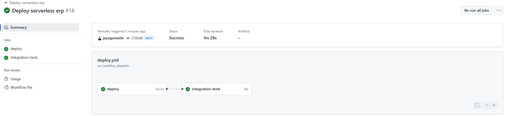
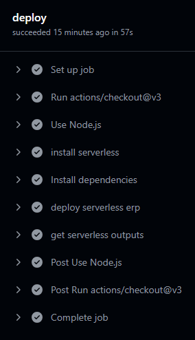

# Serverless ERP

A serverless ERP system built with AWS Lambda, API Gateway, and DynamoDB using the Serverless Framework.

## Overview

This project implements a serverless ERP system with invoice management capabilities. It provides RESTful API endpoints for creating, retrieving, and updating invoices.

## Architecture

- **AWS Lambda** - Serverless compute for API handlers
- **Amazon API Gateway** - RESTful API endpoints
- **Amazon DynamoDB** - NoSQL database for storing invoice data
- **Serverless Framework** - Infrastructure as Code (IaC) for deployment

## Development

### Prerequisites

- Node.js v22+
- AWS CLI configured with appropriate permissions
- Serverless Framework CLI

### Installation

```bash
npm install
```

### Deployment

```bash
serverless deploy --stage [stage] --region [region]
```

## Testing

### Unit Tests

```bash
npm test
```

### Integration Tests

```bash
npm run test:integration
```

## API Documentation

The API is documented using Swagger UI, which is automatically generated using the `serverless-auto-swagger` plugin.

### Swagger UI

After deploying the application, you can access the Swagger UI.

Here you can explore and test all available endpoints:

### Available Endpoints

- `GET /invoices` - Retrieve all invoices with optional filtering
- `GET /invoice/{invoiceId}` - Retrieve a specific invoice by ID
- `POST /invoice` - Create a new invoice
- `PUT /invoice/{invoiceId}/payment-status` - Update payment status of an invoice


## CI/CD

This project uses GitHub Actions for continuous integration and deployment:

### Workflow Triggers

- **Automatic**: Triggered on push to the `main` branch
- **Manual**: Can be triggered manually with customizable parameters

### Deployment Options

- **Environment**: Choose between `dev`, `test`, or `prod` (default: `dev`)
- **AWS Region**: Select from `us-east-1`, `us-west-2`, `eu-west-1`, or `ap-south-1` (default: `us-east-1`)

### Workflow Steps

1. **Setup**: Checkout code and set up Node.js v22
2. **Build**: Install dependencies and Serverless Framework
3. **Deploy**: Deploy to AWS using Serverless Framework
4. **Validation**: Extract service endpoint for testing
5. **Testing**: Run integration tests against the deployed API

### Required Secrets

- `SERVERLESS_ACCESS_KEY`: Required for deploying to AWS

### Screen Shots of the GitHub Actions workflow:






